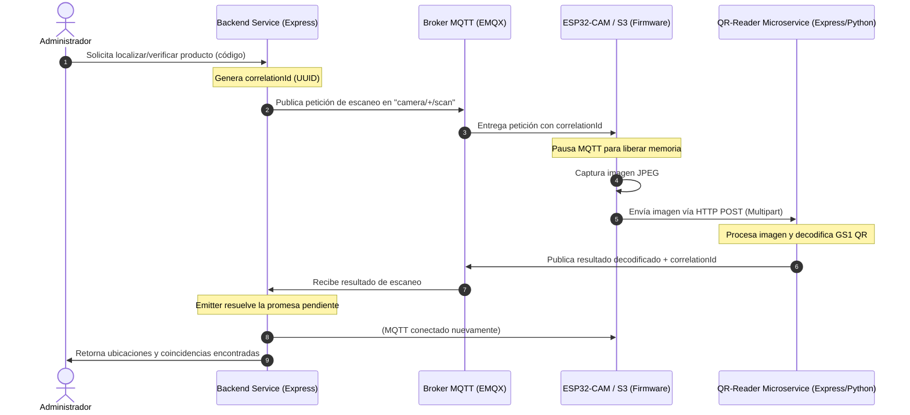

# 🚀 Backend-Service (Gestión y Automatización de Inventarios IoT)

Este es el servicio backend central para el sistema de automatización y control de inventarios en bodegas mediante tecnologías IoT. El sistema permite registrar, despachar, auditar y localizar mercancías de forma automatizada mediante el uso de cámaras inteligentes (ESP32-CAM / ESP32-S3) integradas con un Broker MQTT y un lector de códigos de barra/QR basados en GS1.

---

## 📑 Tabla de Contenidos

- [Descripción del Proyecto](#-descripción-del-proyecto)
- [Arquitectura del Sistema](#-arquitectura-del-sistema)
- [Tecnologías Utilizadas](#-tecnologías-utilizadas)
- [Estructura del Proyecto](#-estructura-del-proyecto)
- [Requisitos Previos](#-requisitos-previos)
- [Configuración de Entorno](#-configuración-de-entorno)
- [Guía de Despliegue](#-guía-de-despliegue)
  - [Despliegue Local](#despliegue-local)
  - [Despliegue en Render (Backend)](#despliegue-en-render-backend)
  - [Despliegue en Vercel (Backend Serverless)](#despliegue-en-vercel-backend-serverless)
  - [Base de Datos en Neon (PostgreSQL Cloud)](#base-de-datos-en-neon-postgresql-cloud)
- [Uso y Documentación de la API](#-uso-y-documentación-de-la-api)
- [Integración de Cámaras con PlatformIO](#-integración-de-cámaras-con-platformio)
  - [Configuración de Entornos (platformio.ini)](#configuración-de-entornos-platformioini)
  - [Configuración de Credenciales de Cámara (secret.h)](#configuración-de-credenciales-de-cámara-secreth)
  - [Flujo de Autenticación de Dispositivos](#flujo-de-autenticación-de-dispositivos)
  - [Detección de Objetos en el Borde (FOMO Edge Impulse)](#detección-de-objetos-en-el-borde-fomo-edge-impulse)

---

## 📌 Descripción del Proyecto

El backend expone APIs REST y servicios en tiempo real para gestionar la lógica de negocio de bodegas, pallets, cajas, productos, proveedores, órdenes de compra/despacho, auditorías e históricos de escaneos. 

El principal valor añadido es la **automatización de flujos**:
1. **Ingreso (Entry)**: Una cámara en la zona de recepción detecta mercancía y reporta el ingreso automático de cajas.
2. **Salida (Exit/Dispatch)**: Cámaras en las puertas de despacho validan la salida física de pallets y cajas contra las órdenes activas.
3. **Localización de Productos (Verification)**: El backend publica una orden de escaneo vía MQTT para activar cámaras específicas de la zona, localizando un producto particular en tiempo real.

---

## 🏗 Arquitectura del Sistema

El sistema utiliza una arquitectura orientada a eventos para el desacoplamiento entre hardware de recursos limitados (cámaras) y la lógica de negocio del servidor.

### Diagrama de Arquitectura y Flujo de Escaneo



### Componentes de la Arquitectura
*   **Servicio Backend (Node.js/Express):** Administra la lógica empresarial, autenticación de usuarios/cámaras, persistencia de datos y sincronización de eventos de escaneo.
*   **Base de Datos (PostgreSQL):** Gestionado mediante Sequelize ORM. Guarda las relaciones de inventarios, roles, logs de auditoría y credenciales de cámaras.
*   **Broker MQTT (EMQX Cloud):** Intermediario de mensajería ligero. Permite al backend comandar cámaras y recibir confirmaciones en tiempo real de forma asíncrona.
*   **Microservicio Lector QR (Externo):** Procesa las imágenes enviadas por la cámara y decodifica las especificaciones GS1.
*   **Firmware ESP32 (PlatformIO):** Software embebido que ejecuta en los dispositivos físicos de captura.

---

## 🛠 Tecnologías Utilizadas

Las tecnologías clave del backend son:
*   **Entorno de ejecución:** Node.js (v24+) en formato ES Modules.
*   **Framework backend:** Express.
*   **Base de datos / ORM:** PostgreSQL / Sequelize.
*   **Mensajería IoT:** MQTT (biblioteca `mqtt`).
*   **Autenticación:** JSON Web Tokens (JWT) y cifrado con `bcryptjs`.
*   **Auditoría y Logs:** Pino con visualización formateada vía `pino-pretty`.
*   **Documentación de API:** Swagger UI (`swagger-ui-express` y `swagger-jsdoc`).

---

## 📂 Estructura del Proyecto (Backend)

*   `src/app.js`: Punto de entrada del Express app, configura Swagger, middlewares e inicializa MQTT.
*   `src/server.js`: Levanta el servidor HTTP.
*   `src/config/`: Contiene la carga y tipado de variables de entorno ([env.js](./src/config/env.js)) y configuración general ([config.js](./src/config/config.js)).
*   `src/controller/`: Controladores encargados de recibir peticiones HTTP y devolver respuestas estandarizadas.
*   `src/service/`: Lógica de negocio (orquestación, transacciones de inventario, etc.).
*   `src/repositories/`: Capa de persistencia SQL usando modelos de Sequelize.
*   `src/models/`: Definición de los esquemas de base de datos relacionales.
*   `src/libs/`: Componentes transversales como base de datos, JSON Web Tokens, Logger y la lógica del suscriptor/publicador de MQTT.
*   `src/route/`: Enrutadores de Express organizados por componentes.
*   `src/middlewares/`: Middlewares de seguridad (RBAC), autenticación de cámaras, y manejo global de errores.

---

## 📋 Requisitos Previos

Antes de ejecutar o desplegar el proyecto, asegúrate de contar con:
1. **Node.js** v20.x o superior instalado.
2. **PostgreSQL** configurado y en ejecución.
3. Un **Broker MQTT** disponible (p. ej., EMQX, Mosquitto, HiveMQ).
4. El compilador de **PlatformIO** (como extensión de VS Code o CLI) para subir el firmware a las cámaras.

---

## ⚙️ Configuración de Entorno

Copia el archivo `.env-example` a un nuevo archivo `.env` en la raíz del backend:
```bash
cp .env-example .env
```

Llena las variables requeridas. Las configuraciones más críticas se describen a continuación:

| Variable | Descripción | Ejemplo de Valor |
| :--- | :--- | :--- |
| `PORT` | Puerto de escucha de la aplicación REST. | `3000` |
| `BASE_PATH` | Prefijo global para las rutas de la API. | `/iot/v1` |
| `DB_HOST`, `DB_PORT`, `DB_DATABASE`, `DB_USERNAME`, `DB_PASSWORD` | Conectividad a la Base de Datos PostgreSQL. | `localhost`, `5432`, `postgres`, `postgres`, `password` |
| `SQ_SYNC_ALTER` | Sincroniza los modelos con la DB sin borrar datos. | `true` (en desarrollo) / `false` (producción) |
| `SQ_SYNC_FORCE` | Vuelca la base de datos y recrea las tablas de nuevo. | `false` (¡Cuidado en producción!) |
| `JWT_SECRET_KEY` | Llave secreta para firmar tokens de usuarios. | `clave_secreta_usuario` |
| `JWT_SECRET_KEY_CAM` | Llave secreta exclusiva para firmar tokens de cámaras. | `clave_secreta_camara` |
| `MQTT_URL` | URL de conexión del Broker MQTT (soporta `mqtts://` y `mqtt://`). | `mqtts://broker-url.emqxsl.com:8883` |
| `MQTT_SUBCRIBE_TOPIC` | Canal de escucha de eventos decodificados (QR). | `warehouses/+/scan/result` |
| `MQTT_PUBLISH_TOPIC` | Canal de publicación de órdenes a cámaras (reemplaza `%CAMERA%`). | `cameras/%CAMERA%/scan` |
| `TIMEOUT_MQTT` | Tiempo límite de espera (ms) para recibir respuesta de cámaras. | `50000` |

---

## ⚙️ Guía de Despliegue

### Despliegue Local

1. Instala las dependencias necesarias:
   ```bash
   npm install
   ```
2. Inicializa tu servidor PostgreSQL local y crea la base de datos correspondiente.
3. Configura el archivo `.env` con las credenciales locales de la DB y del Broker MQTT.
4. Ejecuta el servidor en modo desarrollo con recarga automática:
   ```bash
   npm run dev
   ```
5. Para ejecutarlo en producción:
   ```bash
   npm start
   ```

### Despliegue en Render (Backend)

Render es ideal para desplegar el servicio de Node.js continuo que requiere conexión permanente con el Broker MQTT:
1. Crea un **Web Service** en Render.
2. Vincula tu repositorio de GitHub.
3. Selecciona la región más cercana y el entorno **Node**.
4. Define los comandos de construcción y arranque:
   * **Build Command:** `npm install`
   * **Start Command:** `npm start`
5. Agrega las variables de entorno definidas en tu `.env` dentro de la pestaña *Environment* de Render.
6. Habilita un servicio de Base de Datos PostgreSQL en Render si deseas hosting DB unificado.

### Despliegue en Vercel (Backend Serverless)

El proyecto incluye un archivo de configuración [vercel.json](./vercel.json) listo para desplegar el backend Express como Serverless Functions.

1. Instala la CLI de Vercel globalmente (si no la tienes):
   ```bash
   npm install -g vercel
   ```
2. Inicia sesión y ejecuta el comando en la raíz del backend:
   ```bash
   vercel
   ```
3. Completa los pasos en consola. Vercel detectará el archivo [vercel.json](./vercel.json) y enrutará las peticiones HTTP a `src/server.js`.
   > [!WARNING]
   > Las conexiones persistentes de MQTT vía WebSockets/TCP pueden cerrarse prematuramente en entornos Serverless de corta duración. En este escenario, asegúrate de que el backend gestione reconexiones rápidas o considera mover el publicador a un microservicio tradicional en Render.

### Base de Datos en Neon (PostgreSQL Cloud)

Para bases de datos de alto rendimiento basadas en la nube y optimizadas para serverless, se recomienda Neon:
1. Crea una cuenta gratuita en [Neon.tech](https://neon.tech) y crea un nuevo proyecto de PostgreSQL.
2. Copia la cadena de conexión (Connection String).
3. Asegúrate de agregar los parámetros SSL necesarios en tu panel de variables de entorno de Render o Vercel:
   * `DB_SSL_REQUIRE=true`
   * `DB_SSL_UNAUTHIRIZED=false` (o `true` si el certificado no es firmado por una entidad reconocida).
4. Asigna las variables `DB_HOST`, `DB_USERNAME`, `DB_PASSWORD`, y `DB_DATABASE` basándote en la cadena de conexión provista por Neon.

---

## ▶️ Uso y Documentación de la API

La aplicación expone una interfaz visual interactiva para pruebas mediante **Swagger UI**.
*   **URL de Acceso:** `http://localhost:3000/iot/v1/docs` (reemplaza localhost y puerto por la URL de producción).
*   **Estilo Personalizado:** Cuenta con una interfaz optimizada con tema oscuro integrada con buscadores rápidos para facilitar la evaluación y auditorías de jurados de tesis.

### Endpoints Clave
*   **Autenticación de Dispositivo:** `POST /auth/login/camera` — Devuelve el JWT temporal para la cámara.
*   **Búsqueda en Zonas (MQTT trigger):** `POST /automation` — Envía comando a cámaras y retorna la ubicación física del producto.
*   **Detección / Ingreso:** `POST /automation/register/merchandise` — Registra una caja mediante código GS1 y asocia a ubicaciones.
*   **Despacho:** `POST /automation/dispatch/merchandise` — Descarga del inventario y actualiza el estado de la orden de salida.

---

## ⚙️ Integración de Cámaras con PlatformIO

Las cámaras inteligentes del sistema utilizan el microcontrolador ESP32 y se programan utilizando el ecosistema de **PlatformIO**. La configuración del firmware del proyecto de hardware se encuentra en la carpeta `Iot-Firmware`.

### Configuración de Entornos (platformio.ini)

El archivo `platformio.ini` está configurado para dar soporte a dos placas de desarrollo comunes en el ámbito de visión artificial IoT:

1.  **`esp32dev` (ESP32-CAM AI Thinker):** Módulo tradicional económico con cámara OV2640.
2.  **`freenove_s3` (Freenove ESP32-S3 Wroom):** Módulo de alta potencia con procesador de doble núcleo S3, soporte de instrucciones vectoriales para Redes Neuronales (ESP-NN) y bus PSRAM ultrarrápido Octal SPI (OPI).

```ini
[platformio]
default_envs = esp32dev

; =====================================================
; ESP32-CAM AI THINKER
; =====================================================
[env:esp32dev]
platform = espressif32
board = esp32dev
framework = arduino
monitor_speed = 115200
upload_speed = 115200
board_build.psram = enabled
monitor_rts = 0
monitor_dtr = 0
build_flags =
    -D CAMERA_AI_THINKER
    -DBOARD_HAS_PSRAM
lib_deps =
    knolleary/PubSubClient@^2.8
    bblanchon/ArduinoJson@^7.0.4

; =====================================================
; FREENOVE ESP32-S3
; =====================================================
[env:freenove_s3]
platform = espressif32
board = freenove_esp32_s3_wroom
framework = arduino
monitor_speed = 115200
upload_speed = 921600
board_build.arduino.memory_type = qio_opi
board_build.flash_mode = qio
lib_ldf_mode = deep+
build_flags =
    -D CAMERA_FREENOVE_S3
    -DBOARD_HAS_PSRAM
    -mfix-esp32-psram-cache-issue
    -DEI_CLASSIFIER_TFLITE_ENABLE_ESP_NN=1
    -DESP_NN_ESP32S3
    -O3
    -DCONFIG_ESP32S3_DATA_CACHE_SIZE=0x8000
lib_deps =
    knolleary/PubSubClient@^2.8
    bblanchon/ArduinoJson@^7.0.4
```

> [!TIP]
> Al compilar con el entorno de **`freenove_s3`**, se optimiza la velocidad del bus flash (`qio`) y se activan las optimizaciones del compilador (`-O3`) junto con las librerías vectoriales de aceleración de inferencia TensorFlow Lite (`-DESP_NN_ESP32S3`), lo que reduce la latencia de detección en el microcontrolador.

### Configuración de Credenciales de Cámara (secret.h)

Para vincular una cámara física con la red local y con el backend, debes crear un archivo de encabezado `secret.h` dentro de `src/config/` del proyecto de PlatformIO (puedes tomar como base `secrets.txt`):

```cpp
#pragma once

// WIFI Credentials
#define WIFI_SSID "Tu_Nombre_Red_WiFi"
#define WIFI_PASSWORD "Tu_Contraseña_WiFi"

// MQTT Settings
#define MQTT_HOST "host-broker-mqtt.emqxsl.com"
#define MQTT_PORT 8883 // Puerto Seguro SSL
#define MQTT_USERNAME "tesis"
#define MQTT_PASSWORD "clave_mqtt_autorizada"
#define MQTT_CLIENT_ID "CAM-01" // ID único por cámara
#define MQTT_TOPIC "camera/CAM-01/scan" // Topic al que se suscribe la cámara

// Services Link
#define MAIN_BACKEND_LOGIN "https://tu-dominio-backend.onrender.com/iot/v1/auth/login/camera"
#define MAIN_BACKEND_SCAN "https://qr-reader-server.onrender.com/read-qr/"

// Camera Identity (Registrada previamente en el Backend)
#define CAMERA__CODE "CAM-01"
#define CAMERA__KEY "llave_api_generada_por_el_backend_en_el_registro"
```

### Flujo de Autenticación de Dispositivos

1. **Registro:** El administrador crea la cámara en el backend llamando a `POST /device/register` especificando el código de cámara (`CAM-01`) y la zona asignada. El backend responde con una `api_key` cifrada de un solo uso.
2. **Login Inicial:** Al encender el ESP32, se inicia el servicio `auth.service` y realiza una petición HTTPS POST al backend en la ruta `MAIN_BACKEND_LOGIN` enviando el JSON: `{"code": "CAM-01", "api_key": "..."}`.
3. **Gestión de Token:** El backend verifica la firma e integridad, y si coincide, devuelve un JWT firmado con validez de larga duración. El ESP32 almacena el token temporal en la RAM (`auth.store.cpp`) para incluirlo en la cabecera `Authorization: Bearer <token>` en futuros envíos REST de mercancías.

### Detección de Objetos en el Borde (FOMO Edge Impulse)

La carpeta `IoT_FOMO_DEC_CONF` implementa un firmware autónomo donde el ESP32-S3 ejecuta un modelo de inteligencia artificial local (FOMO - Faster Objects, More Objects) entrenado en Edge Impulse:
*   **Lógica:** Captura fotogramas de forma continua. Si detecta cajas (`box`) o pallets (`pallet`) con un nivel de confianza aceptable, activa el envío serial de la captura de imagen codificada en Base64 (`[SNAPSHOT_BEGIN]...[SNAPSHOT_END]`) para procesamiento alternativo o auditoría sin depender del broker de mensajería principal para la detección inicial.