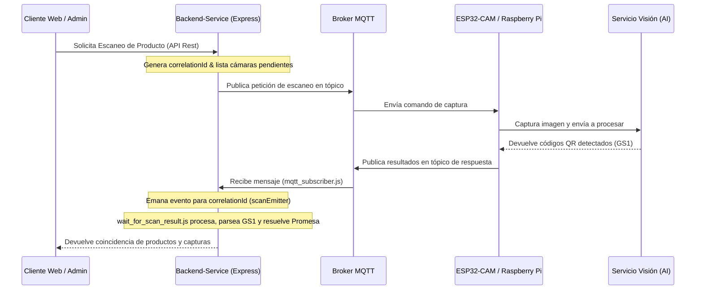

# Backend-Service

Backend centralizado del sistema automatizado de gestión de inventarios basado en tecnologías IoT, códigos QR GS1 y visión artificial.

Este servicio coordina la comunicación entre los dispositivos IoT (ESP32-CAM, Raspberry Pi), los servicios de procesamiento de imágenes, la base de datos relacional y la interfaz web de administración. Implementa la lógica de negocio para la gestión de inventarios, localización en tiempo real de productos, procesamiento de movimientos, validación de órdenes de salida y trazabilidad de productos.

---

## 📑 Tabla de Contenidos
- [Descripción del Proyecto](#-descripción-del-proyecto)
- [Arquitectura del Sistema](#-arquitectura-del-sistema)
- [Tecnologías Utilizadas](#-tecnologías-utilizadas)
- [Requisitos Previos](#-requisitos-previos)
- [Instalación y Configuración](#%EF%B8%8F-instalación-y-configuración)
- [Variables de Entorno (.env)](#-variables-de-entorno-env)
- [Comandos de Ejecución y Mantenimiento](#-comandos-de-ejecución-y-mantenimiento)
- [Lógica Crítica del Sistema](#-lógica-crítica-del-sistema)
  - [1. Flujo de Escaneo y Localización en Tiempo Real (IoT + MQTT)](#1-flujo-de-escaneo-y-localización-en-tiempo-real-iot--mqtt)
  - [2. Estructura y Procesamiento de Códigos QR GS1](#2-estructura-y-procesamiento-de-códigos-qr-gs1)
  - [3. Auditoría Automática (Hooks de Sequelize)](#3-auditoría-automática-hooks-de-sequelize)
- [Estructura del Proyecto](#-estructura-del-proyecto)

---

## 📌 Descripción del Proyecto
El backend forma parte de una solución orientada a la automatización del control y localización de inventario dentro de bodegas logísticas. 

### Principales Responsabilidades:
* **Administración de Inventario:** Control de productos, categorías, almacenes y zonas de almacenamiento.
* **Control de Movimientos:** Registro y trazabilidad de movimientos de entrada y salida de mercancía.
* **Validación de Órdenes:** Verificación automática de órdenes de salida para evitar despachos incorrectos o no autorizados.
* **Gestión IoT y Visión Artificial:** Coordinación de búsquedas físicas en zonas a través de cámaras ESP32-CAM.
* **Comunicación en Tiempo Real:** Envío y recepción de mensajes a través del protocolo MQTT.
* **Auditoría:** Registro automático de las modificaciones de datos críticos en el sistema.

---

## 🏗 Arquitectura del Sistema
El backend actúa como un orquestador central que interactúa con:
1. **Aplicación Web de Administración:** Para la gestión de usuarios, visualización del dashboard y envío manual de órdenes de escaneo.
2. **Broker MQTT:** Para el paso de mensajes asíncronos y bidireccionales con baja latencia.
3. **Dispositivos ESP32-CAM y Raspberry Pi:** Activan las cámaras físicas, capturan imágenes de los pallets/cajas y envían los resultados.
4. **Servicio de Visión Artificial:** Procesa la imagen capturada para detectar los códigos GS1 y determinar su nivel de confianza.
5. **Base de Datos PostgreSQL:** Almacena el estado relacional del inventario, usuarios, roles, auditoría e historial de escaneos.

---

## 🛠 Tecnologías Utilizadas
* **Node.js (v18+)** - Entorno de ejecución de JS en el servidor con soporte para ES Modules.
* **Express (v5)** - Framework web rápido y minimalista para el enrutamiento y middlewares de la API REST.
* **PostgreSQL & Sequelize** - Base de datos relacional y ORM para modelado de datos y sincronización del esquema.
* **MQTT (mqtt.js)** - Cliente de mensajería ligero para la comunicación con los microcontroladores.
* **JWT (jsonwebtoken)** - Autenticación y autorización basada en roles (`ADMIN`, `USER`, etc.) y llaves dedicadas para dispositivos (`JWT_SECRET_KEY_CAM`).
* **Bcryptjs** - Algoritmo de hashing seguro para el almacenamiento de contraseñas.
* **Pino** - Logger estructurado de alta eficiencia.

---

## 📋 Requisitos Previos
* **Node.js** 18 o superior instalado.
* **npm** 9 o superior instalado.
* **PostgreSQL** 14 o superior.
* **Broker MQTT** (ej. Eclipse Mosquitto local o CloudMQTT).

---

## ⚙️ Instalación y Configuración

1. **Clonar el repositorio:**
   ```bash
   git clone https://github.com/Los-Malditos-Tesis/Backend-Service.git
   cd Backend-Service
   ```

2. **Instalar dependencias:**
   ```bash
   npm install
   ```

3. **Configurar las variables de entorno:**
   Crea un archivo `.env` en la raíz del proyecto basándote en el archivo de ejemplo:
   ```bash
   cp .env-example .env
   ```
   Abre el archivo `.env` y define los valores específicos para tu entorno (ver sección de [Variables de Entorno](#-variables-de-entorno-env)).

---

## 🔑 Variables de Entorno (.env)

El archivo `.env` configura el comportamiento y la conectividad del servidor. A continuación se detallan todas las variables disponibles:

| Variable | Tipo / Valor Ejemplo | Descripción |
| :--- | :--- | :--- |
| **PORT** | `3000` | Puerto en el que el servidor Express escuchará las peticiones REST. |
| **ENV_NODE** / **NODE_ENV** | `development` / `production` | Modo de entorno del servidor. |
| **BASE_PATH** | `/iot/v1` | Prefijo global para las rutas de la API REST del backend. |
| **DB_DATABASE** | `bodega_db` | Nombre de la base de datos de PostgreSQL. |
| **DB_USERNAME** | `postgres` | Usuario administrador de PostgreSQL. |
| **DB_PASSWORD** | `tu_contraseña` | Contraseña del usuario de PostgreSQL. |
| **DB_HOST** | `localhost` | Host del servidor de base de datos. |
| **DB_DIALECT** | `postgres` | Dialecto utilizado por el ORM Sequelize. |
| **DB_PORT** | `5432` | Puerto de conexión a PostgreSQL. |
| **SQ_SYNC_ALTER** | `true` / `false` | Si es `true`, Sequelize altera las tablas existentes para reflejar cambios en los modelos sin borrarlas. |
| **SQ_SYNC_FORCE** | `true` / `false` | Si es `true`, Sequelize destruye y recrea todas las tablas al arrancar el servidor (pérdida de datos). |
| **APP_LOCALE** | `sv-SE` | Localización/idioma por defecto para la lógica interna de fechas y formateo. |
| **APP_TIMEZONE** | `America/El_Salvador` | Zona horaria para la persistencia y control de marcas de tiempo. |
| **JWT_SECRET_KEY** | `clave_secreta_usuario` | Semilla para firmar/verificar tokens JWT de los usuarios administradores. |
| **JWT_EXPIRATION** | `24h` / `7d` | Tiempo de vida de los tokens JWT de los usuarios del sistema. |
| **JWT_ALGORITHM** | `HS256` | Algoritmo criptográfico utilizado para la generación de tokens JWT. |
| **JWT_ISSUER** | `backend-service` | Emisor del token JWT. |
| **JWT_AUDIENCE** | `admin-web` | Destinatario o audiencia del token JWT. |
| **JWT_SECRET_KEY_CAM** | `clave_secreta_camara` | Semilla específica para validar tokens de las cámaras (ESP32-CAM). |
| **JWT_EXPIRATION_CAM**| `365d` | Tiempo de vida extendido para las claves de los dispositivos físicos. |
| **ENCRYP_SALT** | `10` | Cantidad de rondas de salting utilizadas por Bcrypt para hashear contraseñas. |
| **DUMMY_HASH** | `$2b$...` | Hash de relleno para mitigar ataques de temporización en la validación de contraseñas. |
| **DEFAULT_ROLE** | `USER` | Rol por defecto asignado a nuevos registros de usuarios. |
| **MIN_CONFIDENCE** | `0.7` | Umbral de certeza del algoritmo de visión artificial para registrar un QR como válido. |
| **MQTT_URL** | `mqtt://localhost` | Dirección de conexión al Broker MQTT (ej. `mqtt://` o `mqtts://`). |
| **MQTT_USERNAME** | `user_mqtt` | Usuario para la autenticación en el Broker MQTT. |
| **MQTT_PASSWORD** | `pass_mqtt` | Contraseña para la autenticación en el Broker MQTT. |
| **MQTT_CLIENT_ID** | `backend_client` | Identificador único de este backend dentro del broker MQTT. |
| **MQTT_SUBCRIBE_TOPIC**| `cameras/%CAMERA%/scan` | Tópico de escucha para recibir eventos de escaneo provenientes de cámaras. |
| **MQTT_PUBLISH_TOPIC**  | `warehouses/+/scan/result` | Tópico para notificar los resultados de escaneo procesados a los suscriptores. |
| **TIMEOUT_MQTT** | `5000` | Tiempo de espera (en milisegundos) para recibir confirmaciones de escaneo MQTT. |
| **AUTO_CREATE_SCAN_CONFIG** | `true` | Si es `true`, se creará de forma automatizada una configuración base si el dispositivo no tiene una registrada. |

---

## 🛠 Comandos de Ejecución y Mantenimiento

En el archivo [package.json](file:///c:/Users/eduar/Desktop/tesis/Backend-Service/package.json) se definen scripts clave para la operación del servidor y la base de datos:

### Comandos de Ejecución del Servidor
* **Modo Desarrollo:** Levanta la aplicación y escucha cambios en tiempo real en los archivos fuentes usando la funcionalidad nativa de Node.js `--watch`.
  ```bash
  npm run dev
  ```
* **Modo Producción:** Levanta el servidor Express de forma estándar.
  ```bash
  npm start
  ```

### Comandos de Base de Datos y Semillas (Scripts)
Los siguientes comandos gestionan el ciclo de vida de la estructura y de los datos iniciales de la base de datos PostgreSQL:

1. **`npm run generate:seeders`**
   * **Comando interno:** `node scripts/generateSeeders.js`
   * **Propósito:** Genera archivos de seeders (semillas de datos) de forma automatizada, permitiendo estructurar conjuntos de datos predefinidos (productos, configuraciones base, usuarios) para insertarlos posteriormente.
2. **`npm run db:migrate`**
   * **Comando interno:** `node scripts/migrate.js`
   * **Propósito:** Ejecuta manualmente scripts de sincronización o migración de la base de datos en PostgreSQL a través del ORM Sequelize, forzando la actualización de tablas e índices sin requerir que la aplicación Express esté corriendo en producción.
3. **`npm run db:seed`**
   * **Comando interno:** `node scripts/seed.js`
   * **Propósito:** Pobla la base de datos con los datos semilla iniciales y requeridos. Esto incluye la creación de roles indispensables (`ADMIN`, `USER`), parámetros globales de la bodega, y usuarios de prueba.

---

## 🧠 Lógica Crítica del Sistema

### 1. Flujo de Escaneo y Localización en Tiempo Real (IoT + MQTT)
Para localizar un producto físicamente en la bodega, el backend orquesta un flujo asíncrono y en tiempo real usando un sistema basado en eventos (`EventEmitter`) y el broker MQTT:



* **Correlación de Mensajes (`correlationId`):** Cada solicitud de escaneo genera un identificador único. Cuando las cámaras responden asíncronamente vía MQTT, incluyen este `correlationId`.
* **Escuchador Temporizado (`waitForScanResults`):** El backend crea una promesa que se suscribe a los eventos con el `correlationId` correspondiente. Si el conjunto de cámaras responde antes del `TIMEOUT_MQTT`, el backend consolida y devuelve los datos inmediatamente; de lo contrario, se aplica un timeout de seguridad resolviendo los resultados recolectados hasta el momento.

### 2. Estructura y Procesamiento de Códigos QR GS1
El backend incluye un parser especializado en el estándar GS1 (`src/utils/gs1_util.js`) para clasificar de manera automática los ítems escaneados:

* **Pallets (Tarimas):** Identificados por el código **SSCC (AI: 00)** de 18 dígitos. Para que un pallet se catalogue como válido, debe incluir obligatoriamente los Application Identifiers (AI) de GTIN (AI: 01), unidades por ítem (AI: 30) y cantidad de bultos o cajas (AI: 37).
* **Cajas (Boxes):** Identificados por el código **GTIN (AI: 01)** y un número de serie único **(AI: 21)**. Adicionalmente, incluye el conteo de unidades internas mediante el identificador de aplicación **(AI: 30)**.

### 3. Auditoría Automática (Hooks de Sequelize)
El sistema implementa hooks automáticos de Sequelize integrados en el proceso de persistencia (`src/repositories/audit_repository.js`). Cualquier inserción, actualización o eliminación en tablas críticas (como movimientos de inventario u órdenes) genera automáticamente una entrada en la tabla de auditoría (`audits`), registrando los cambios, el usuario responsable y el contexto temporal de la transacción.

---

## 📂 Estructura del Proyecto

A continuación se detalla la función de cada uno de los directorios clave del backend:

* **`src/config/`**: Gestión de variables de entorno del sistema (`env.js`), objeto de configuración unificado (`config.js`) y configuración del cliente MQTT (`mqtt_config.js`).
* **`src/controller/`**: Controladores de Express encargados de capturar los parámetros de entrada de las peticiones HTTP y retornar las respuestas de la API.
* **`src/dto/`**: Data Transfer Objects utilizados para asegurar la validación sintáctica y el tipado de los datos que entran a los endpoints.
* **`src/errors/`**: Definición de clases de errores personalizados y el middleware controlador de errores globales del servidor.
* **`src/libs/`**: Integraciones con librerías externas o utilidades técnicas de infraestructura:
  * `database/`: Conexión de Sequelize y el script de sincronización.
  * `encrypt/`: Wrapper de Bcrypt para cifrado de credenciales.
  * `jwt/`: Utilería para generar y verificar Json Web Tokens.
  * `logger/`: Implementación de logs estructurados con Pino.
  * `mqtt/`: Suscriptores, publicadores y control de espera de escaneo.
* **`src/middlewares/`**: Middlewares globales y de enrutamiento (autenticación JWT, control de roles, validaciones sintácticas).
* **`src/models/`**: Definiciones de los modelos de Sequelize con sus relaciones y constraints a nivel de base de datos.
* **`src/repositories/`**: Capa de abstracción de acceso a datos directa a través de Sequelize para encapsular queries complejas y hooks de auditoría.
* **`src/route/`**: Módulos de enrutamiento de Express organizados por recurso (auth, devices, product, order, scan, etc.).
* **`src/service/`**: Capa de lógica de negocio pura, aislando el comportamiento transaccional e integraciones del framework Express.
* **`src/utils/`**: Helpers utilitarios como el analizador GS1 y constantes generales del sistema.